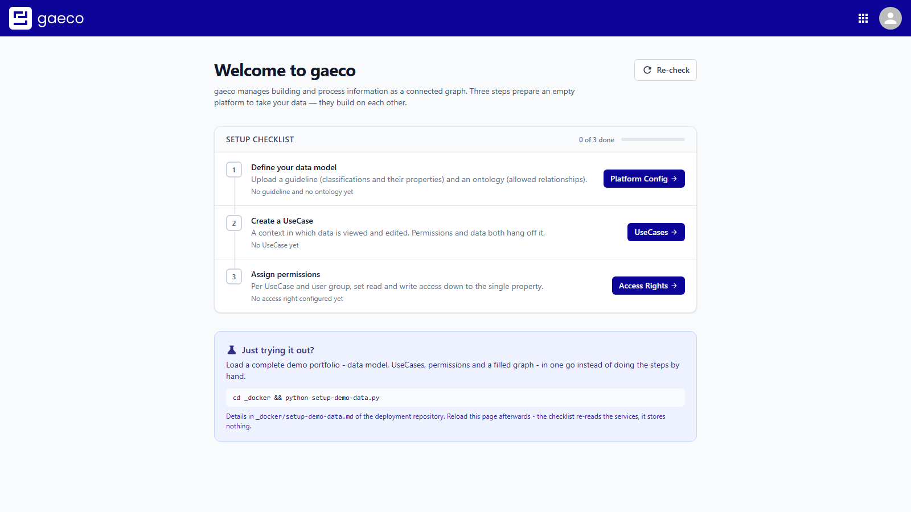
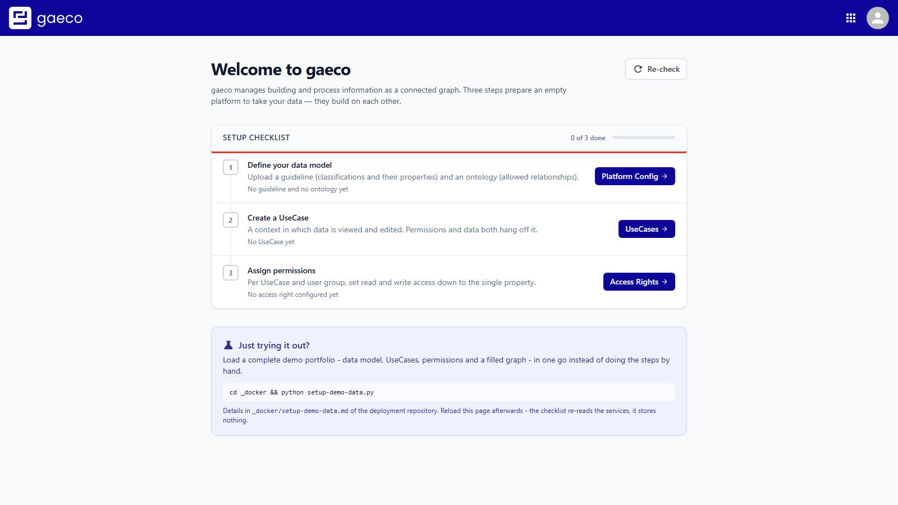

# 1. First start

This guide takes a freshly installed gaeco platform from nothing to actual data. It assumes the
stack is running — see the [repository README](../../README.md) if it is not.

Four steps, in this order, because each one depends on the previous:

| | Step | Why it has to come first |
| --- | --- | --- |
| 1 | [Define the data model](02-data-model.md) | Nothing else can refer to classifications that do not exist |
| 2 | [Create a UseCase](03-usecase.md) | Data and permissions both hang off one |
| 3 | [Assign permissions](04-permissions.md) | Granted per property, within a UseCase |
| 4 | [Create data](05-creating-data.md) | Only offers what you have write access to |

If you would rather not do this by hand, the [demo data](../../demodata/setup-demo-data.md) script
does all four in one go. Come back here when you want to understand what it did.

## Signing in

Open <http://localhost:5000>. The platform redirects to Keycloak, which asks for credentials.

The realm shipped with this repository contains the user **`admin`** with the password
**`admin`**, in the group `/Admin`. After signing in you land on the start page.

## The setup checklist

The start page lists what the platform still needs, with a button per row that opens the module
doing that step. Use it as the navigation for everything below.

## Adding a user

The platform ships with a **ready-made Keycloak realm**, so there is nothing to configure for a
normal start. The one thing you are likely to want is another account.

In the Keycloak admin console at <http://localhost:9345/admin> (sign in as `admin` / `admin`, then
switch to the **gaeco** realm):

1. **Users → Add user**, give it a username, **Create**.
2. **Credentials → Set password**, and switch *Temporary* off unless you want the user to be asked
   to change it on first sign-in.
3. **Groups → Join Group**, and pick **Admin**.

Step 3 is the one that is easy to miss. Group membership is not a formality here: [access
rights](04-permissions.md) are granted *to a user group*, so an account in no group can sign in and
then sees nothing at all — which looks like a broken platform rather than a missing group.

`Admin` is the only group the shipped realm contains. Further groups are worth creating once you
want different people to see different parts of the data — they appear in the **User Group**
selector in Access Rights as soon as they exist.

> Users live in Keycloak's own database, which is stored under `volumes/`. Stopping the stack keeps
> them; a **clean start** (`start-gaeco.bat` → *Clean start? Y*) deletes that folder and re-imports
> the realm, so you are back to `admin` alone. Note that `docker compose down -v` on its own does
> *not* do this — see [Stopping & cleaning up](../../README.md#stopping--cleaning-up).

---

Next: [Define the data model](02-data-model.md)
