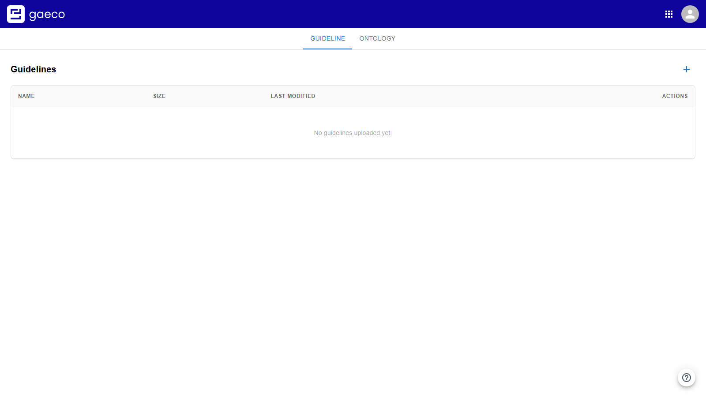
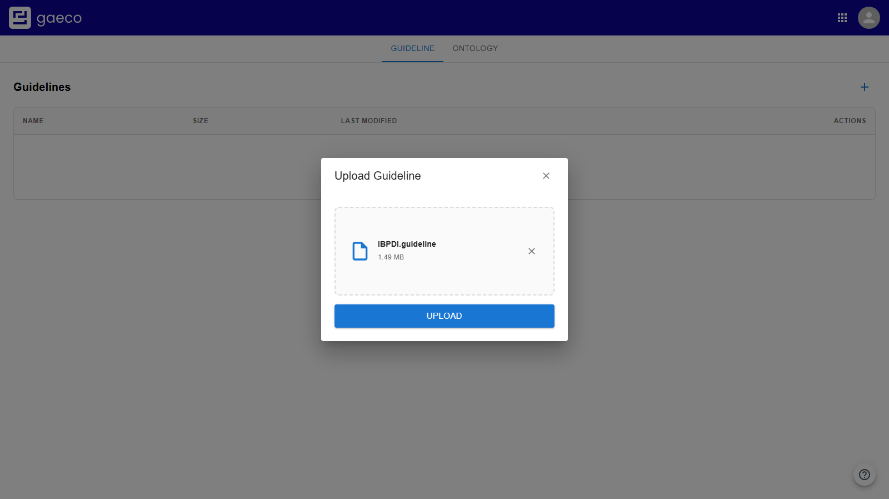
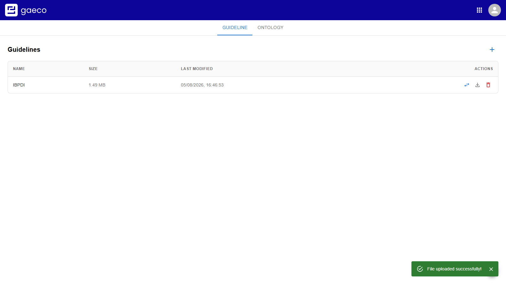
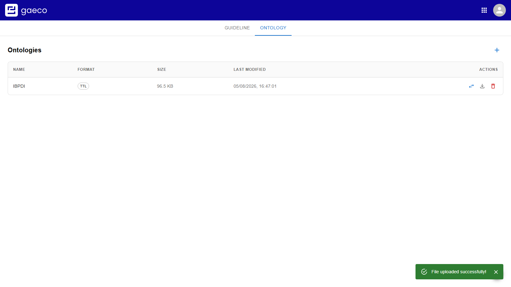

# 2. Define the data model

Everything in gaeco refers to one shared data model. It is made of two files, and both are needed
before anything else can be configured.

- A **guideline** defines the *classifications* — the object types you work with, such as portfolio,
  building, floor and space — and the *properties* each of them carries.
- An **ontology** declares which *relationships* are permitted between those classifications, for
  example that a building has floors.

Put crudely: the guideline says what may exist, the ontology says what may be connected. Neither
contains any actual data.

Both are managed in the **Platform Config** module.

## Where the files come from

They are exported from the **Guideline Editor**. This repository ships a ready-made pair for the
IBPDI Real Estate Common Data Model — an international standard for building and real-estate
information — in [`demodata/IBPDI/`](../../demodata/IBPDI):

| File | Contains |
| --- | --- |
| `IBPDI.guideline` | The classifications and their properties (JSON) |
| `IBPDI.ttl` | The permitted relationships (RDF Turtle) |

Neither is meant to be written by hand.

## Uploading the guideline

On the **Guideline** tab, choose **+**. The dialog takes the file by click or by drag and drop, one
at a time.

Press **Upload**. The entry appears in the table with its size and upload time.

### Expect a wait here

The file being listed is not the end of it. Its contents are published as an event, and every other
service then rebuilds its own view of the model. IBPDI is around 1.5 MB, and until that finishes the
Access Rights module in [step 3](04-permissions.md) has nothing to offer and keeps its selectors
disabled.

This is the one point in the whole setup where patience is genuinely required. It is not a fault —
give it a moment and reload.

## Uploading the ontology

Switch to the **Ontology** tab and upload `IBPDI.ttl` the same way.

An ontology is far smaller, so it propagates quickly.

The class names in the ontology have to match the classifications in the guideline. A relationship
whose two ends name something the guideline does not declare can never be offered later.

## Replacing a model later

Each row offers **Replace file**, **Download** and **Delete**.

Replacing is the operation to be careful with:

- If the new guideline no longer contains a classification or a property, **the access rights that
  referred to it are removed with it**, and instances created under it lose the part of the model
  that described them.
- Replacing an *ontology* does **not** delete relationships that already exist. A graph can
  therefore hold a relationship the current ontology would no longer permit.

The practical rule: adding classifications and properties is safe, removing or renaming them is
not, because the rest of the platform refers to them by identifier. Restructure before data exists.

Uploading a *second* guideline instead of replacing the first is possible, and both then coexist —
with the effect that every classification appears twice in Access Rights. Unless you deliberately
want two models on one platform, replace rather than add.

---

Previous: [First start](01-first-start.md) · Next: [Create a UseCase](03-usecase.md)
