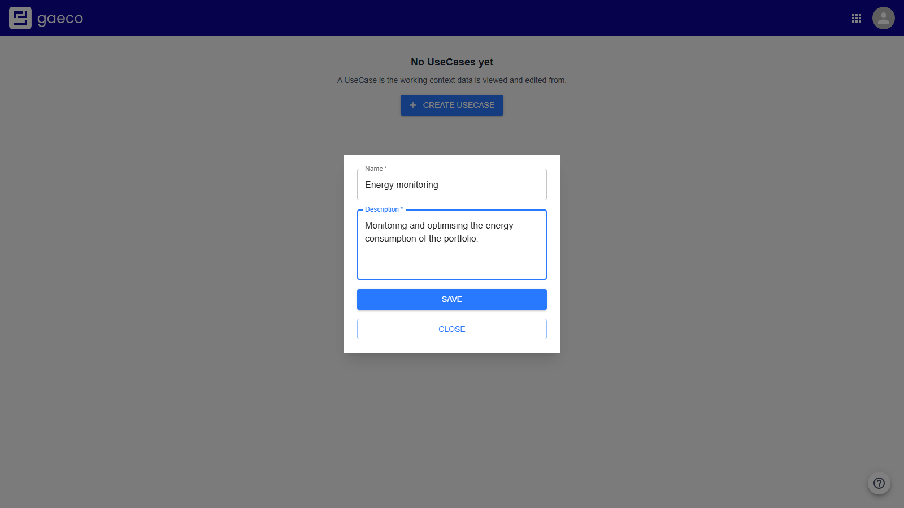
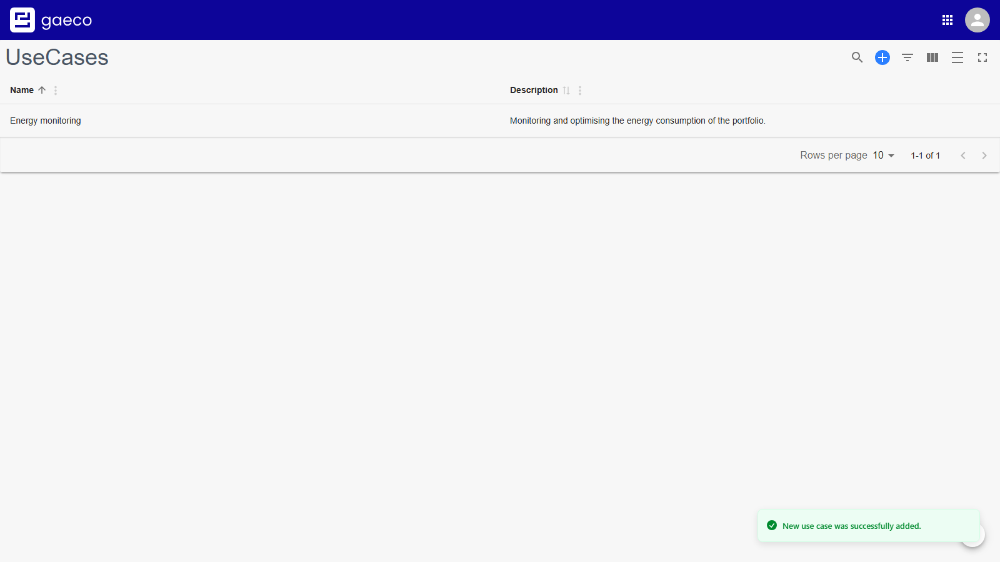

# 3. Create a UseCase

A UseCase is the **working context** that data is viewed and edited from. gaeco never simply shows
all the data: every view and every permission is bound to one.

The point is that the same object can be relevant in different ways to different tasks. Energy
management and maintenance planning both address the same building and need different parts of it.
The building is stored **once**; the UseCase decides which section of it is relevant, and who may
see or change what.

That is why this step comes before permissions — rights are granted *within* a UseCase, so there is
nothing to configure until one exists.

## Creating one

Open the **UseCases** module. On an empty platform it offers a prominent **Create UseCase**; once
rows exist the control moves into the table toolbar as **Add UseCase**.

A name and a description are both required.

### Choosing the name

Worth a moment's thought, because this name is what everyone picks from later, in every other
module's UseCase selector.

Name it after **the task it serves**, not after a department or a team:

| Good | Poor |
| --- | --- |
| Energy monitoring | Facility Management Team |
| Maintenance planning | Abteilung 4 |
| Space management | Project Blue |

A UseCase called after a team says nothing about what the context is *for*, and stops being
accurate the moment the team is reorganised.

**Save** adds it to the table.

## Editing

Double-click any cell to change it. The change applies when the field loses focus — `Enter`, `Tab`,
or a click outside the cell.

Renaming a UseCase is safe: the data and the permissions attached to it refer to its identifier, not
its name.

## Deleting

Deliberately not offered. A UseCase is referenced by the permissions configured for it and by the
data created under it, so removing one is not a local operation. Retire a context by taking its
permissions away instead.

## How many do you need?

Start with one. A UseCase per real task is the intent; a UseCase per user or per team is a sign that
permissions are being modelled in the wrong place — that is what user groups are for.

---

Previous: [Define the data model](02-data-model.md) · Next: [Assign permissions](04-permissions.md)
