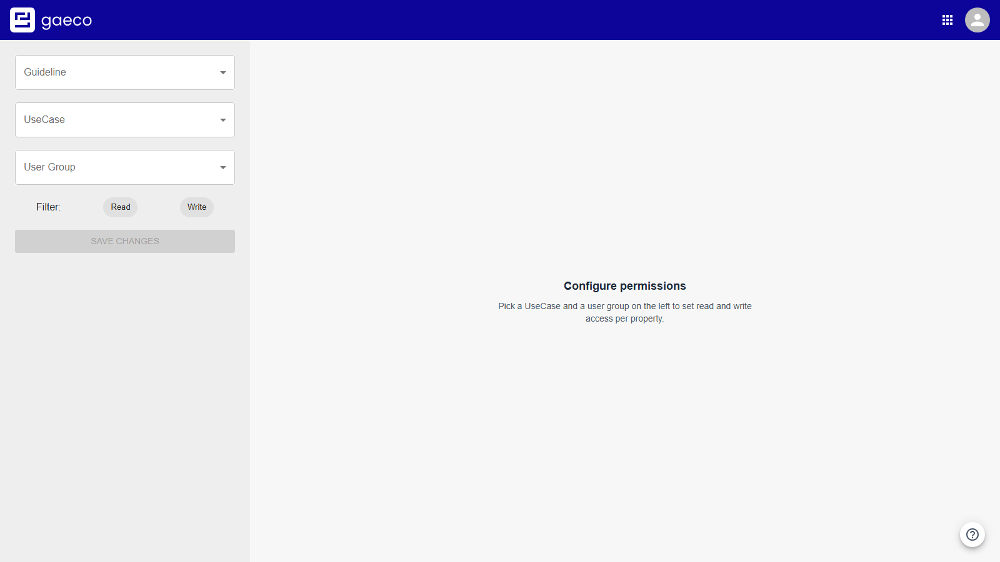
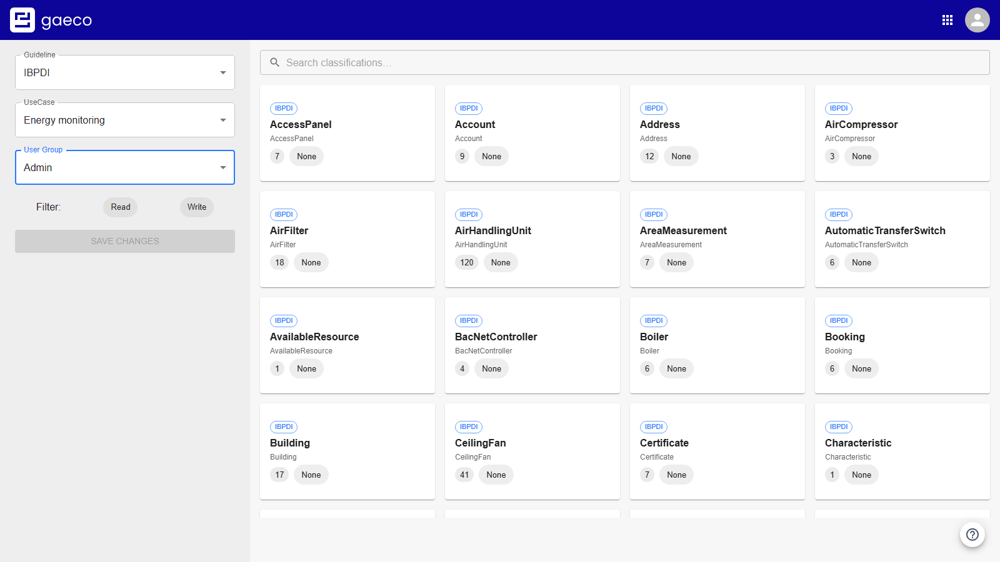
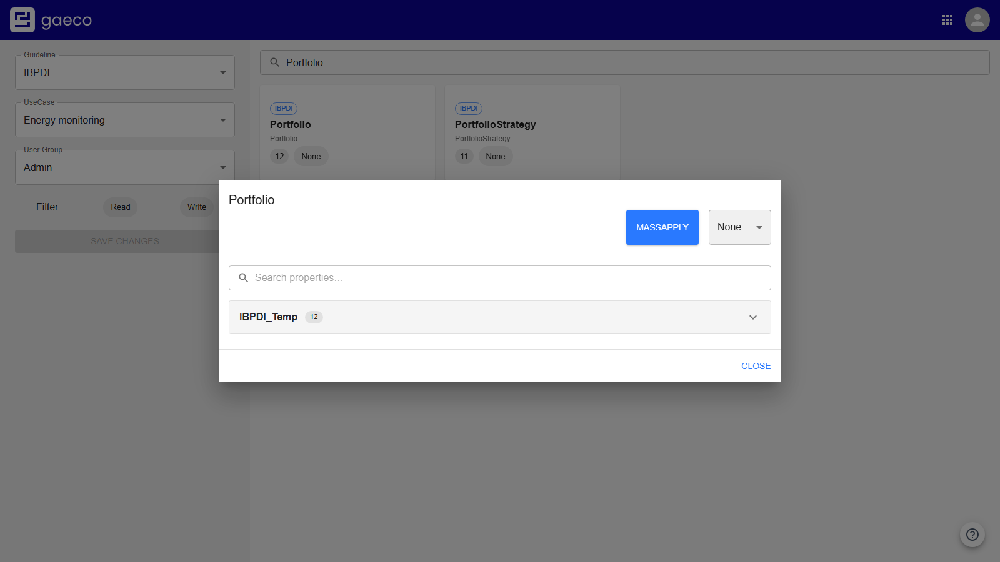
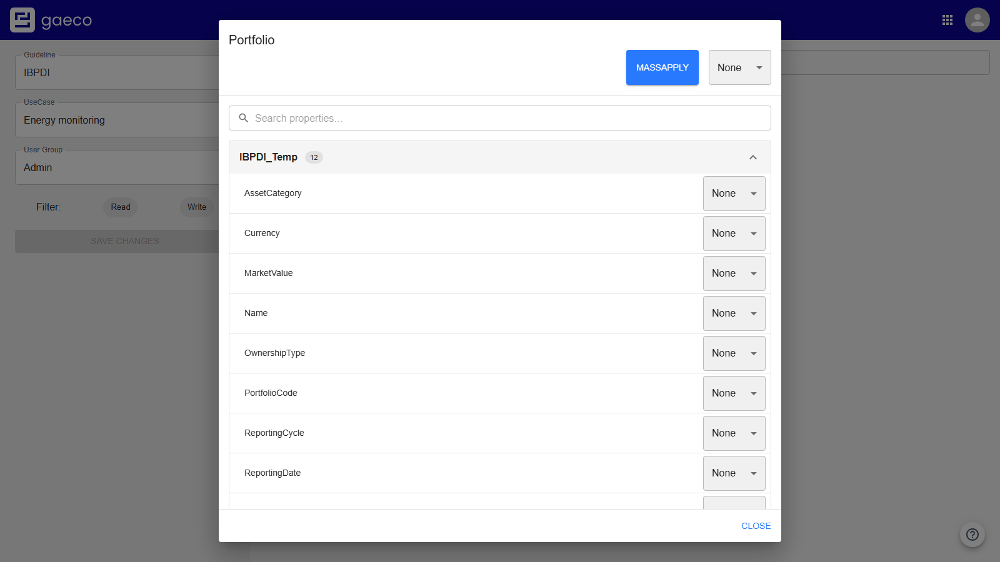
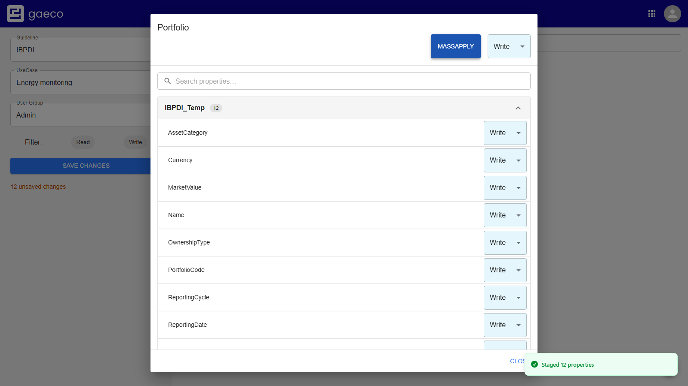
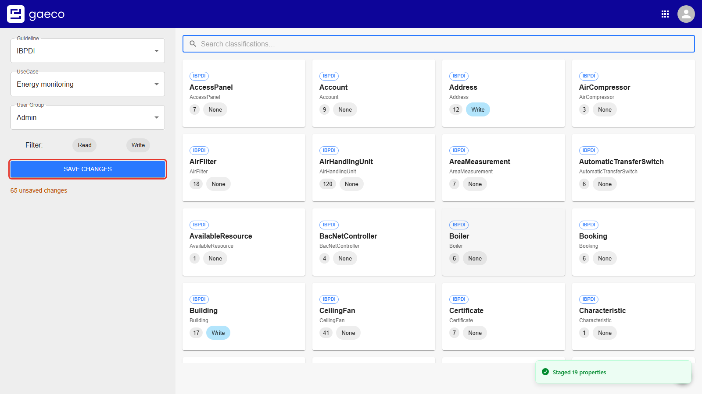
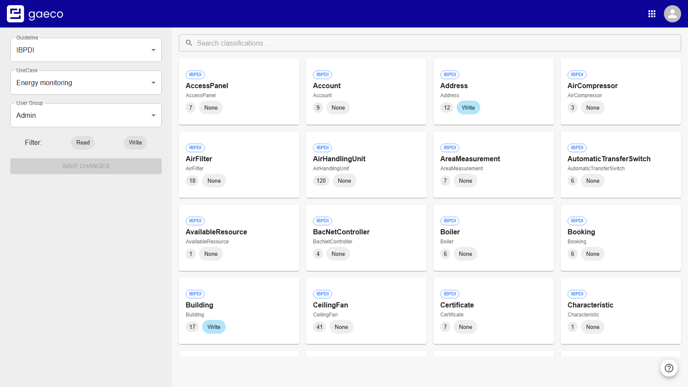

# 4. Assign permissions

This is the step that decides what anyone actually sees, and it is finer-grained than most systems:
**a right is stored for one single property**, for one user group, within one UseCase.

A group can be allowed to read a building's name, edit its building code, and not see its market
value at all — three different rights inside the same classification, in the same UseCase.

Open the **Access Rights** module. It starts empty, because a permission only means something for an
exact combination.

## Setting the context

Three selectors on the left:

| Selector | Meaning |
| --- | --- |
| **Guideline** | Optional. Scopes the list to one data model — useful if more than one is uploaded |
| **UseCase** | Required. The working context these rights apply in |
| **User Group** | Required. Comes from Keycloak; the shipped realm has `Admin` |

Nothing is listed until the UseCase and the user group are both set. Once they are, every
classification of the model appears as a card.

Each card shows the classification, how many properties it has, and the right currently in effect:
`None`, `Read`, `Write`, or **`mixed`** when its properties do not all agree.

IBPDI has several hundred classifications, so use the search box rather than scrolling.

> **If the selectors stay disabled and nothing appears**, the guideline has not finished propagating
> to this service yet — see [step 2](02-data-model.md#expect-a-wait-here). Wait, then reload.

## Down to the property

Click a classification card. What you see first are its **property sets**, the groupings the
guideline defines. They are collapsed.

Expand one and every property is listed, each with its own selector.

| Right | Effect for the user group |
| --- | --- |
| `None` | The property is **hidden** — not greyed out, simply absent |
| `Read` | Shown, but cannot be changed |
| `Write` | Shown, and can be changed |

**`None` hides rather than disables.** This is the single most useful thing to know about the whole
module. Someone reporting that a field "does not exist" is usually looking at a `None`, not at a gap
in the data model. The same applies one level up: a classification with no writable property at all
is simply not offered when creating data.

Setting one property changes only that property; the rest of the set keeps what it had. A
classification whose properties disagree is labelled `mixed` — that is the normal state of a
carefully configured model, not a warning.

## MassApply

Setting several hundred properties one at a time is not practical. Choose a right in the selector
beside **MassApply**, then press **MassApply** to give every property of the open classification that
right.

The usual way to work is MassApply first, to set a baseline for the classification, then adjust the
few properties that need to differ. Note the order: MassApply *overwrites* individual settings, so
doing it afterwards loses them.

Only administrators may assign `None`.

## Saving

Nothing takes effect while you work. Edits are collected, and **Save changes** shows how many are
pending — so a whole classification, or several, can be worked through before anything is written.

Choosing it writes them all at once.

Switching UseCase or user group with edits pending prompts first, so a context switch does not
quietly discard work.

## What to grant for a first run

For the [next step](05-creating-data.md) to have anything to offer, grant **Write** on the
classifications you actually intend to use. For a property portfolio that is:

`Portfolio` · `Building` · `Address` · `Floor` · `Space`

You do not need to touch the other several hundred. A classification with no rights is invisible
rather than broken.

## Filtering

The **Read** and **Write** buttons narrow the list to classifications that have at least one property
with that right — which, on a real model, is the difference between a list of five and a list of five
hundred.

---

Previous: [Create a UseCase](03-usecase.md) · Next: [Create data](05-creating-data.md)
