# 5. Create data

With a data model, a UseCase and permissions in place, the platform can finally hold something. The
**Instances** module is where classifications become actual objects: one specific portfolio, its
buildings, its rooms — created and connected as a graph.

Two views show the same data. The **graph** is for structure: what is connected to what. The
**table** is for content: many values at once, edited like a spreadsheet. The switch is at the top
right.

## Choosing a UseCase

The canvas stays empty until a UseCase is chosen in the toolbar, because the UseCase decides which
part of the graph is shown to you at all — through the access rights configured for it.

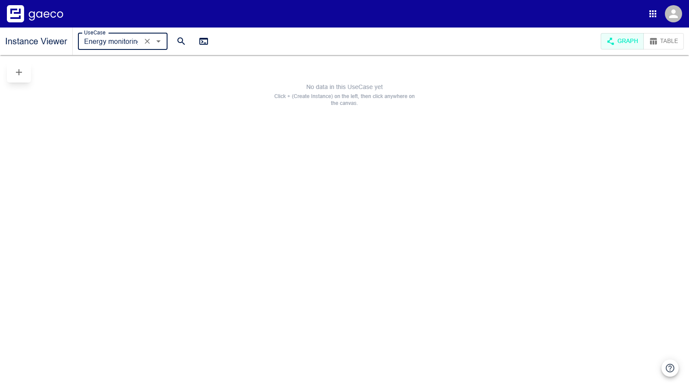

## Creating an instance

**+ (Create Instance)**, at the top left of the canvas, enters creator mode. Two things confirm it:
a coloured bar marks the control as active, and the cursor becomes a crosshair over the canvas.

Click an empty area and the creator panel opens. The instance will be placed where you clicked.

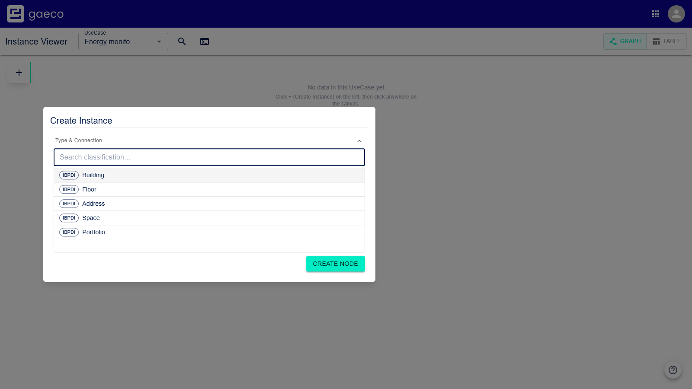

Pick a classification. Then fill in the properties it carries.

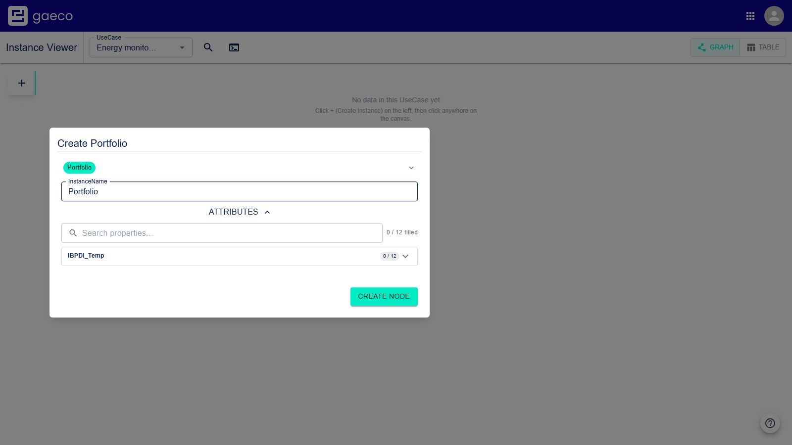

**This is where step 4 pays off.** The list offers *only* the classifications your user group has
**write** access to in this UseCase. Likewise, the fields shown are the properties set to `Write`; a
`Read` property is displayed but not editable, and a `None` property is not there at all.

An empty list on a model with hundreds of classifications is therefore not a fault — it means no
write rights were granted. Go back to [permissions](04-permissions.md).

> `InstanceName` is a label for the instance, not a property of the classification — it is what the
> node shows on the canvas. It arrives pre-filled with the classification name, which is worth
> replacing: on a graph where every node reads "Building", nothing tells you *which* building.

**Create Node** puts it on the canvas.

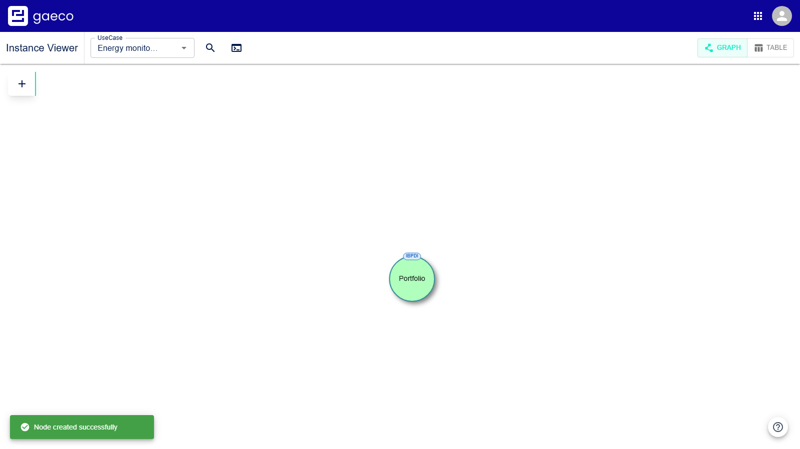

### What the colours mean

A node's **fill** is the access you have to it:

| Colour | Meaning |
| --- | --- |
| **Green** | Full control — editable, relations can be managed, can be deleted |
| **Yellow** | The data is editable, but relations and deletion are not |
| **Red** | Read-only |
| **Very light** | No relevant access right applies |

So a graph of mixed colours is a correctly configured platform, not a broken one.

## Connecting instances

A graph is only useful once things are connected. Create a second instance first — for this
example a `Building`, so that there is something a `Portfolio` may point at.

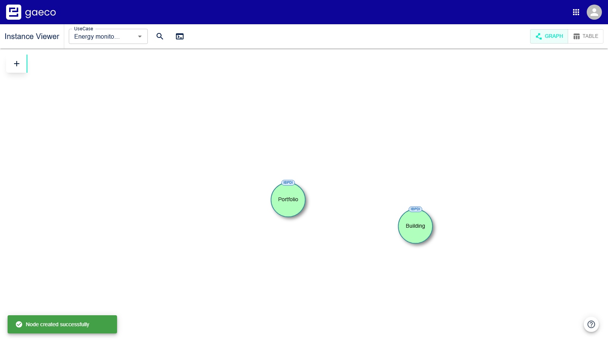

Relationships are **drawn, not filled in**. There is no "create relationship" button to look for:
you stay in the same creator mode and click the two ends.

### Connecting two existing instances

**1. Choose + (Create Instance) to enter creator mode.** You have to be in creator mode — this is
the single most common reason connecting appears not to work. Outside it, clicking an instance opens
it for editing instead.

**2. Click the instance the relationship starts from.** Three things then confirm that the source
was accepted:

- the source gets a **blue** outline,
- a **line follows your cursor** from it, and
- every instance you may connect it to gets an **orange** outline, while everything else **fades to
  grey**.

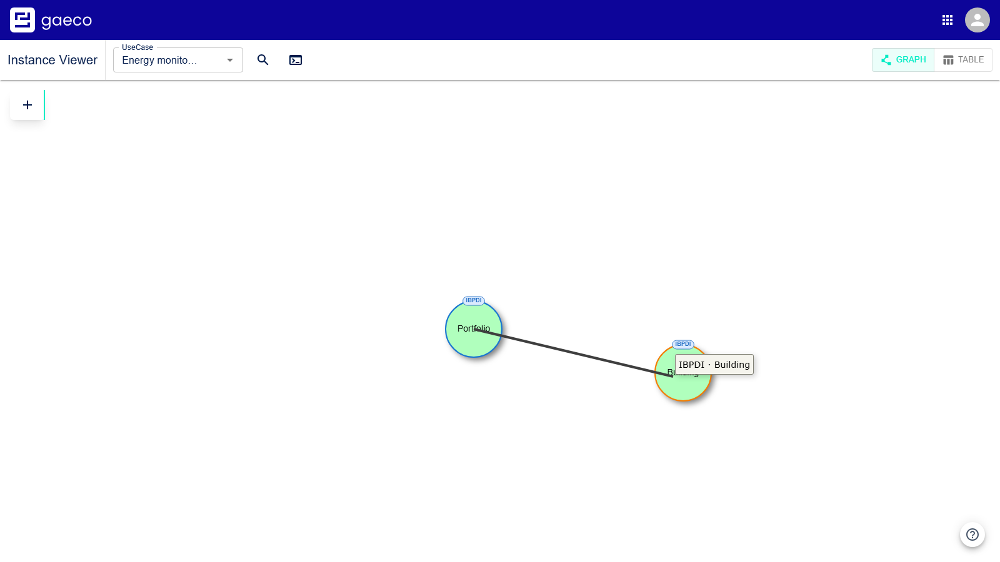

Those outlines are the ontology answering "what may this be connected to", and they are worth
relying on rather than guessing: instead of trying combinations and wondering whether a refusal is
the ontology or a permission, click the source and look at what lights up. The cursor says the same
thing on approach — a crosshair over an instance you may connect to, a blocked cursor over one you
may not.

**3. Click one of the orange-outlined instances.** Only those accept the click; the greyed-out ones
ignore you. The relationship panel opens, naming both ends and the direction in its title, and
offers only the relationships the ontology defines between those two classifications.

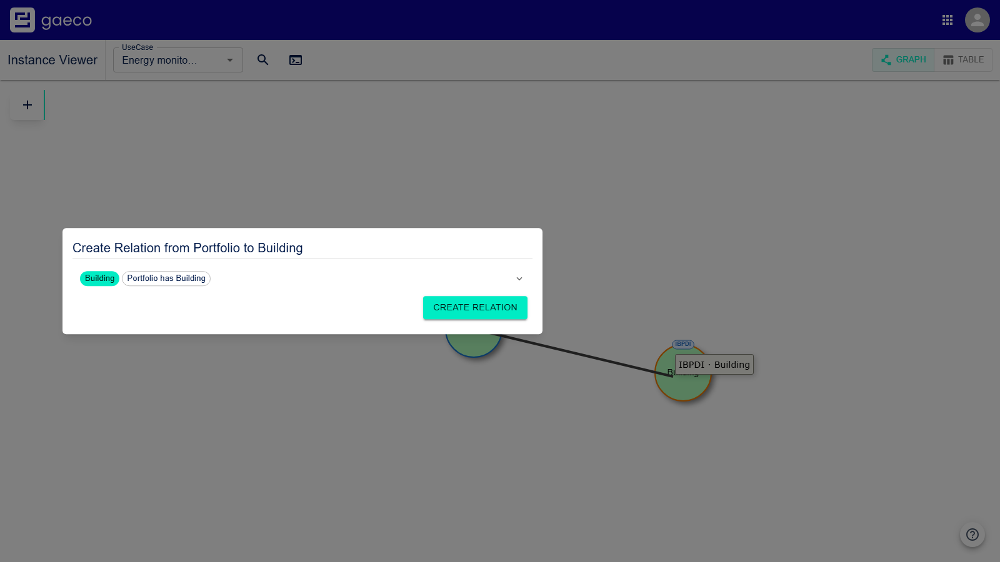

**4. Pick one and confirm with Create Relation.**

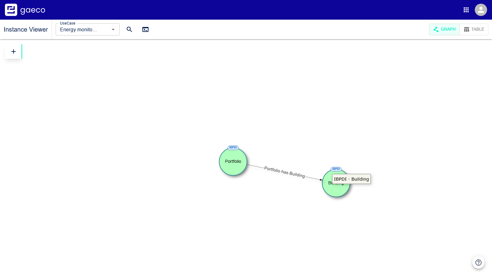

Direction is decided by the order of steps 2 and 3, not in the panel: clicking *from* the portfolio
*to* the building offers `Portfolio has Building`, not the reverse.

### Creating an instance and its relationship in one go

Usually faster when you are building a structure downwards — a building's floors, a floor's rooms:

1. Enter creator mode.
2. Click the **existing** instance to hang the new one off.
3. Click an **empty area** of the canvas.
4. The creator panel opens as usual, but with an extra selector holding the permitted
   relationships. Pick a classification, pick the relationship, fill in the properties.
5. **Create Node** creates both the instance and the relationship.

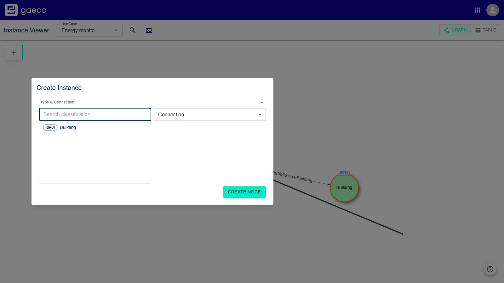

### The same mode, three outcomes

Creator mode is not only for creating — that is the whole interaction model, and it is worth having
in one place:

| In creator mode, click … | … and you get |
| --- | --- |
| an empty area of the canvas | a standalone instance |
| a node, then an empty area | a **new** instance *plus* a relationship from the one you started on |
| a node, then a second node | a **relationship** between two instances that already exist |

### Leaving creator mode

Choose `+` again. The difference is easy to see: **outside** creator mode, clicking an instance
opens it for editing; **inside** it, the same click starts a relationship. So if clicking an
instance is not showing you its data, creator mode is still on.

Closing the panel is not the same as leaving the mode. It clears the instance you had picked as the
source but keeps creator mode on — which is what lets you draw one relationship after another
without switching back and forth.

### When a connection is refused

The click is simply ignored, or the cursor shows as blocked. Work through this in order:

1. **Are you in creator mode?** If clicking an instance opens its data instead of starting a line,
   you are not. Choose `+`.
2. **Was the target outlined orange?** After clicking the source, only those accept a click. If the
   one you want stayed grey, the ontology does not permit that relationship — which is not a fault,
   it is the ontology doing its job.
3. **Have you got the direction right?** Relationships are **directional**: `Building → Floor` does
   not imply `Floor → Building`. Click the other one first and look at the outlines again.
4. **Is the source green?** The line only starts from an instance you have full control of.
   Yellow, red and pale instances ignore the click, because managing relationships needs more than
   edit access to the data — see [the colours](#what-the-colours-mean).

If nothing at all lights up for a classification, the model has no relationship defined from it.
Download the ontology from Platform Config and look for a property whose `rdfs:domain` is that
classification; its `rdfs:range` names what it may point at.

## Unsaved changes

Editing values does not write them immediately, in **either** view. Changes are buffered and the
header shows how many: a chip reading *"N unsaved changes"*, with **Save** and **Discard** beside
it. Nodes holding buffered values are drawn with a dashed outline, so the graph shows what is not
committed yet.

The chip opens the list of buffered fields, grouped by instance, and each instance there can be
reverted on its own. That makes the table an efficient way to fill in many values — work through a
column, check the list, then save once.

Creating an instance or a relationship is *not* buffered: those are written when you confirm.

## Deleting

Right-click a node **or a connecting line**. The menu names what you hit — for a relationship, both
ends and the relationship itself — and offers **Delete**. Where your rights do not allow it, the
entry reads *Access restricted* instead.

Read that name before confirming. Hitting a node when you meant the line between two nodes deletes
the instance *and* every relationship attached to it, which is a much larger change than removing
one connection.

## Finding things on a large graph

The magnifying glass in the header searches instances by name and jumps to the one you pick.

Beside it, the terminal icon opens a field for a Cypher-like query, which pre-filters the graph to
the nodes and relations you care about. The query persists across reloads; the red bin clears it.

## The table view

The switch at the top right shows the same instances as rows.

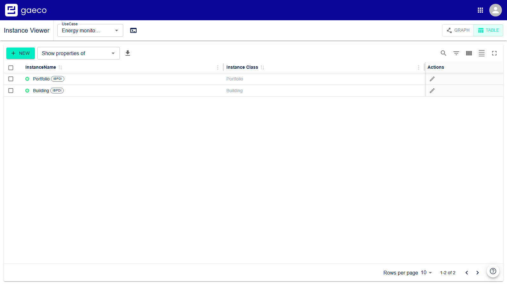

**Show properties of** adds one classification's properties as columns, grouped the same way as in
the creator. The choice is kept in the URL, so it survives a reload and can be shared as a link.

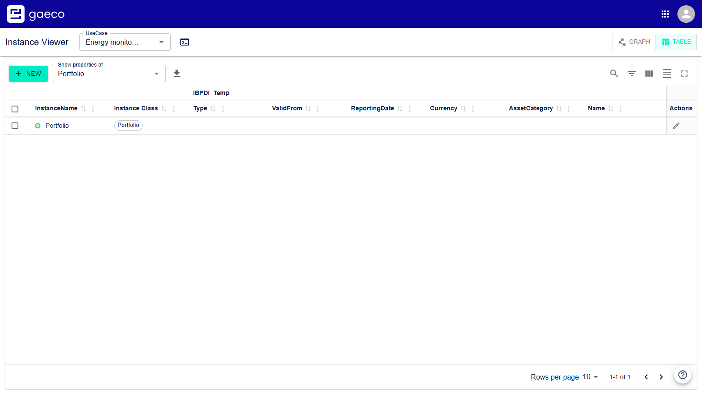

The colours mean the same as in the graph, and a lock marks a `Read` property.

### Editing

Double-click a cell to change it, like in a spreadsheet. The edit is buffered — see [unsaved
changes](#unsaved-changes).

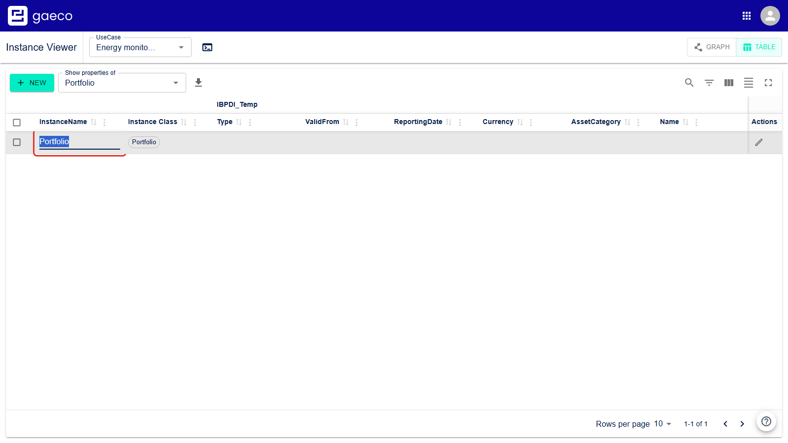

Ticking rows offers to delete them together.

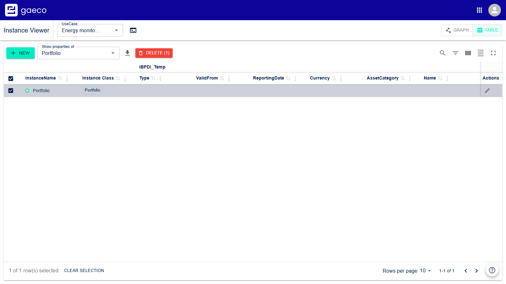

### Filtering and export

The toolbar has the usual controls: a general search, per-column filters that combine, column
visibility, row density, full screen and pagination. The download button exports what is currently
shown as CSV — so the filter is also the way to select what leaves the platform.

---

Previous: [Assign permissions](04-permissions.md) · Back to [the index](README.md)
